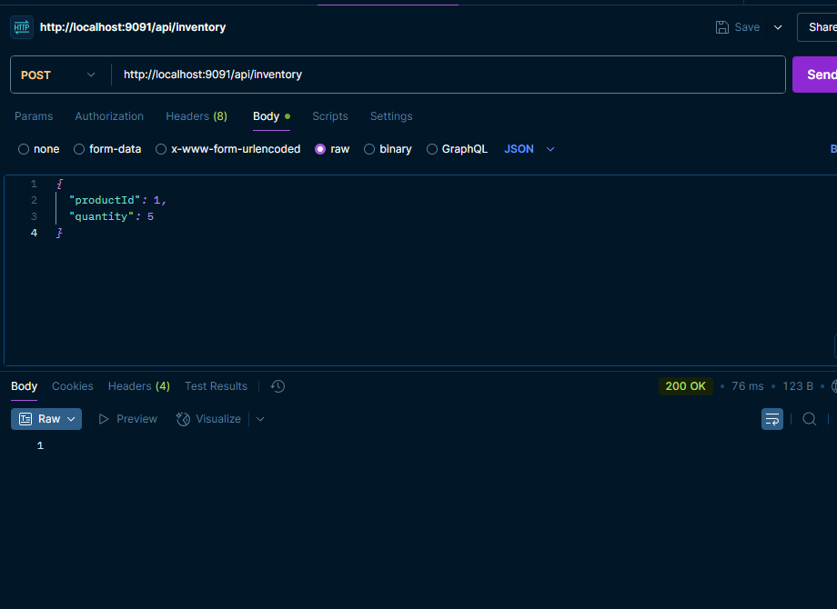

# 📦 MicroInventorySystem-Inventory

### [Microservice 1: Product Service](https://github.com/Ochwada/MicroInventorySystem-Product)

## Microservice 2: Inventory Service - Overview

This is the `Inventory Service`, a core component in a microservices-based inventory system responsible for managing 
product stock levels. It handles inventory creation, updates, and retrieval of stock quantities. The service exposes 
RESTful endpoints that allow other microservices—such as the Product Service—to fetch real-time inventory data and 
ensure availability before processing operations like order placement or stock checks.

## 📦 Features
- Store inventory documents (productId + quantity) in MongoDB 
- Retrieve stock quantity by productId 
- RESTful endpoints using Spring Boot 
- Clean architecture with DTOs and service layer 
- Uses MongoDB as a NoSQL backend for scalability and flexibility

## 🛠 Tech Stack
| Technology              | Purpose                                   |
|-------------------------|-------------------------------------------|
| **Java 17+**            | Main language                             |
| **Spring Boot**         | Application framework                     |
| **Spring Web**          | RESTful API development                   |
| **Spring Data MongoDB** | MongoDB integration for Spring            |
| **Lombok**              | Boilerplate reduction                     |
| **dotenv-java**         | Load environment variables from `.env`    |
| **MongoDB**             | NoSQL database for inventory records      |
| **Maven**               | Build and dependency management           |
| **Docker**              | Containerization for service and database |

## 📁 Project Structure
```yaml
micro-inventory-system/
│
├── docker-compose.yml                 # Root Docker Compose for all microservices
├── .env                               # Global environment variables (Mongo URI, DB password, etc.)
├── README.md                          # Project documentation
│
├── product-service/                  # 🧩 Microservice 1: Product Service (Spring Boot + PostgreSQL)
│   ├── Dockerfile                    # Docker image config for this microservice
│   ├── docker-compose.yml
│   ├── .env
│   ├── pom.xml
│   └── src/
│
├── inventory-service/                 # 🧩 Microservice 2: Inventory Service (Spring Boot + MongoDB)
│   ├── Dockerfile                     # Docker image config for this microservice
│   ├── docker-compose.yml             # Compose file to run this service with MongoDB
│   ├── .env                           # Environment variables (e.g., SPRING_DATA_MONGODB_URI)
│   ├── pom.xml                        # Maven project file
│   ├── README.md                      # Service-level documentation
│   └── src/
│       └── main/
│           ├── java/
│           │   └── com.ochwada.inventoryservice/
│           │       ├── InventoryServiceApplication.java   # Main Spring Boot application
│           │       ├── controller/
│           │       │   └── InventoryController.java       # REST controller for /inventory endpoints
│           │       ├── dto/
│           │       │   └── InventoryRequest.java          # DTO for creating inventory records
│           │       ├── model/
│           │       │   └── Inventory.java                 # MongoDB document model
│           │       ├── repository/
│           │       │   └── InventoryRepository.java       # MongoRepository interface
│           │       └── service/
│           │           └── InventoryService.java          # Business logic layer
│           └── resources/
│               └── application.properties                 # Port, Mongo URI, other settings
│


```

#### 🧩 Highlights:

-  **Independent Microservice** built with **Spring Boot** and **MongoDB**
-  **Stores inventory data** related to product availability (`productId`, `quantity`)
-  **RESTful API** to create, update, and fetch inventory records
-  Uses **MongoRepository** for fast, document-based data access
-  Accepts structured input via **DTOs** (e.g., `InventoryRequest`)
-  Clean **Service Layer** handles business logic separately from the controller
-  Designed for integration with `product-service` via REST communication
-  **Dockerized** and connected via **Docker Compose**
-  Configurable via `.env` and `application.properties` (MongoDB URI, port)
-  Organized project structure with packages:
    - `controller` – request handling
    - `dto` – data transfer objects
    - `model` – MongoDB document schema
    - `repository` – MongoDB access
    - `service` – business logic

## 📡 API Endpoints

| Method | Endpoint                  | Description                         |
|--------|---------------------------|-------------------------------------|
| GET    | `/inventory`              | Get all inventory records           |
| GET    | `/inventory/product/{id}` | Get inventory by product ID *(opt)* |
| POST   | `/inventory`              | Create a new inventory entry        |


## 🐳 Docker Integration
1. `docker-compose.yml`
2. `Dockerfile`